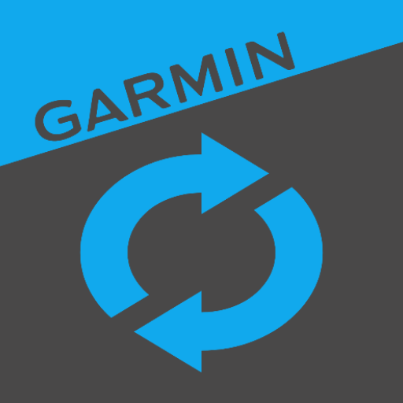

# Garmin Connect Feed

[](https://github.com/paufregi/GarminFeed/actions/workflows/build.yaml)
[](https://github.com/paufregi/GarminFeed/actions/workflows/codeql.yaml)


  Android app designed to seamlessly synchronize weight and body composition data from Renpho Health to Garmin Connect.<br>
  It also offers a convenient way to update Garmin activities using predefined profiles.

<br><br>

## Build

```
./gradlew build
```

## Test

#### Unit tests

```
./gradlew test
```

#### Android tests

```
./gradlew pixel9ProDebugAndroidTest
```
